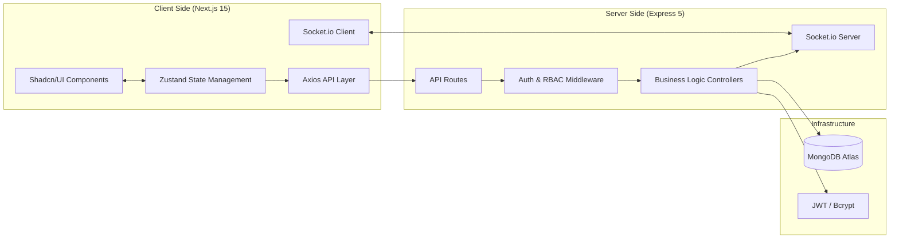
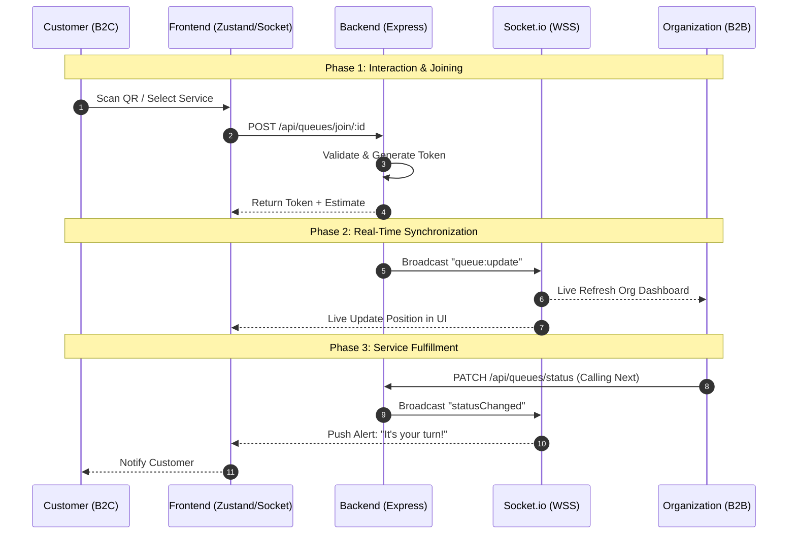

# ⚡ DigiiQ | Real-Time B2B Queue Management SaaS

**DigiiQ** is a sophisticated B2B SaaS platform designed to eliminate physical waiting lines. It provides a seamless, real-time bridge between service providers (Hospitals, Banks, Clinics) and their customers, allowing for virtual queueing, live tracking, and efficient service management.

---

## 🚀 Core Features

### 🏢 For Organizations (B2B)
- **Service Orchestration**: Create and manage multiple service categories (e.g., General Checkup, Emergency, Account Opening).
- **Live Queue Management**: A dynamic dashboard to update customer status (Waiting → In Progress → Completed) in real-time.
- **QR Code Integration**: Unique QR code generation for every service, enabling instant "Scan-to-Join" functionality.
- **Efficiency Metrics**: Configurable average service times to provide accurate wait estimations to customers.

### 👥 For Customers (B2C)
- **Virtual Tokens**: Join queues from anywhere without being physically present.
- **Live Status Tracking**: View real-time position in queue and estimated wait time updates via Socket.
- **History & Records**: Track past visits and service history through a dedicated user dashboard.

---

## 🛠️ Technical Architecture

DigiiQ is built with a focus on high availability, low latency, and modularity.

### **Frontend Stack**
- **Framework**: Next.js 15+ (App Router) for optimized SEO and performance.
- **State Management**: `Zustand` for lightweight, reactive global state.
- **Styling**: Tailwind CSS 4.0 & Shadcn UI for a premium, accessible interface.
- **Communication**: `Socket.io-client` for persistent bi-directional communication.

### **Backend Stack**
- **Engine**: Express 5.0 (Node.js) utilizing ES Modules.
- **Database**: MongoDB with Mongoose for flexible, document-based data modeling.
- **Real-Time**: `Socket.io` server-side integration for instant event broadcasting across namespaces.
- **Security**: JWT-based authentication with HTTP-only cookie storage for XSS/CSRF protection.
- **Integrations**: Twilio API for OTP verification and automated notifications.

---

## 🗺️ System Architecture & Flow

### 1. Logical System Design
A modular breakdown of the DigiiQ ecosystem, highlighting the separation of concerns between the client-side state, server-side logic, and the real-time event bus.

### 2. Core Business Flow: The Queue Lifecycle
This diagram illustrates the "Zero-Wait" philosophy of DigiiQ, showing how a user moves from discovery to service completion without physical friction.

---

## 🚀 My Vision & Future Roadmap

These are the features I have conceptualized and am planning to develop alongside the core product to enhance scalability and production-grade reliability:

### 1. High-Performance Caching
- **Redis Integration**: Implement Redis for storing active queue data to reduce MongoDB read/write overhead during peak hours.

### 2. Advanced Analytics & BI
- Dedicated Analytics Engine for Organizations to visualize peak traffic hours, staff efficiency, and customer drop-off rates.

### 3. Smart Notifications
- **Real-Time Alerts**: Currently, the system relies on active dashboard monitoring. I am planning to integrate native browser/mobile notifications to alert users when their turn is approaching.

### 4. Multi-Channel Notifications
- **Omnichannel Reach**: Integration of Firebase Cloud Messaging (FCM) for native push notifications and WhatsApp Business API for wider reach.

---

  Built with ❤️ for a queue-free world.

